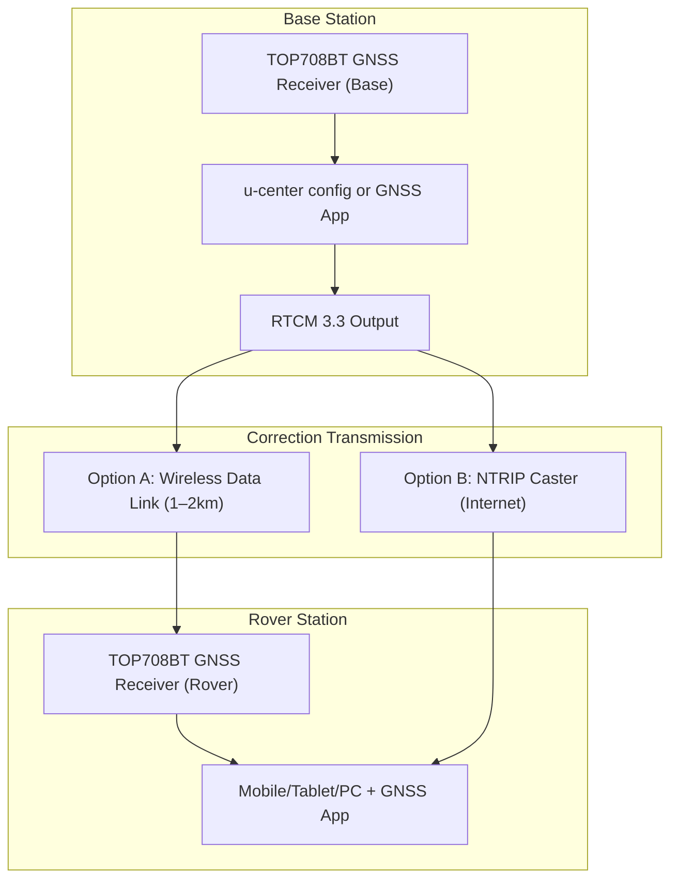

## TOPGNSS TOP708BT GNSS Receiver

**Supported Systems:** GPS / BDS / GLONASS / GALILEO / QZSS

---

### Overview

The TOP708 is a high-precision multi-band GNSS receiver supporting RTK-based centimeter-level positioning via Bluetooth or USB. It integrates:

* A multi-frequency GNSS board
* High-precision antenna
* Bluetooth module
* RTCM correction and RTK support
* Mobile and base station operation
* Secure F9P platform for anti-interference and spoofing detection

---

### Product Features

1. Integrated GNSS board + antenna + Bluetooth
2. Bluetooth 2.0 CLASS 2 with SPP profile
3. NMEA-0183, RTCM 3.3, and UBX protocol support
4. Miniaturized and user-friendly design
5. Centimeter positioning using RTCM3
6. High-speed data transmission (default: 38400 baud)

---

### Technical Specifications

| Feature         | Details                                                          |
| --------------- | ---------------------------------------------------------------- |
| GNSS Engine     | ZED-F9P (184 channels)                                           |
| Frequencies     | GPS L1C/A L2C, GLONASS L1OF L2OF, GALILEO E1B/C E5b, BDS B1I B2I |
| Accuracy        | RTK: 0.01 m + 1 ppm CEP                                          |
| RTK Convergence | < 300s                                                           |
| Baud Rate       | Default: 38400 (configurable)                                    |
| Refresh Rate    | Default: 1Hz (configurable up to 10Hz)                           |
| Output          | USB + Bluetooth (customizable: RS232, UART)                      |
| Voltage         | Default: 5V (customizable to 12–24V)                             |
| Waterproof      | IPX67                                                            |
| Connector       | GX-12 4PIN male                                                  |
| Cable Length    | 2m (default)                                                     |
| Dimensions      | 80mm × 70mm                                                      |
| LED Indicator   | Blue LED for Bluetooth status                                    |

---

### Bluetooth Specs

| Parameter         | Value                                        |
| ----------------- | -------------------------------------------- |
| Version           | V2.0 + EDR                                   |
| Power             | Class 2 (4dBm max)                           |
| Sensitivity       | -80dBm                                       |
| Range             | \~10m (open space)                           |
| Profile           | Serial Port Profile (SPP)                    |
| Data Protocol     | NMEA-0183, UBX, RTCM                         |
| Default Sentences | GGA, GSA, GSV, RMC (optional: VTG, GLL, RMS) |

---

### USB Port Functions

1. **Power Supply**: Can be powered by mobile battery (DC via USB)
2. **Data Communication**: Connects to PC via USB (for NMEA output and config)
3. **Bluetooth Initialization**:

   * Bluetooth name: `TOPGNSS`
   * Pairing password: `1234`
   * Baud rate: `38400`

---

### Software Tools

* **u-center (U-Blox)** for configuration and monitoring
  Download: [u-center Tool](https://www.u-blox.com/en/product/u-center)
* **Android GNSS Viewer**
  App: [PPM Commander - GPS Status](https://play.google.com/store/apps/details?id=de.pilablu.gnsscommander)

---

### Setup and Operation Steps

#### 1. Environmental Requirements

* Use outdoors with clear sky view (no obstructions)

#### 2. Bluetooth Pairing

* Connect 5V USB power to activate device
* Blue LED flashes (ready for pairing)
* On PC/phone, search for Bluetooth: `TOPGNSS`
* Enter password: `1234`
* Upon successful pairing, LED remains steady

#### 3. Data Viewing and Config

* Launch `u-center` on PC
* Select correct COM port at `38400` baud
* View NMEA/RTCM output, configure as base/rover

#### 4. Mobile App Usage (Android)

* Use PPM Commander or similar app
* Simulate GPS location for mapping applications
* Forward RTCM correction data via NTRIP

---

### RTK Communication Workflow

#### A. Using a Public NTRIP Service

1. **Connect to Bluetooth**
2. **Open GNSS App**
3. **Configure NTRIP client**
4. **Login to NTRIP provider**
5. **Start RTK session**

#### B. Self-Built RTK System

1. **One TOP708 as Base Station**

   * Output RTCM3.3 data (e.g., 1005 message)
   * Share via wireless module (1–2 km range)

2. **Another TOP708 as Rover**

   * Receives RTCM corrections
   * Computes RTK position (centimeter accuracy)

#### C. NTRIP Configuration for Base

* Output RTCM 1005, etc.
* Use wireless or internet bridge to send data to NTRIP caster

---

### Development and Deployment Notes

#### For Development:

* Use `u-center` to simulate and test both rover and base behavior
* Integrate data stream via Bluetooth (SPP) or USB for:

  * Mapping apps
  * GIS data collection
  * Custom applications (using NMEA or UBX)

#### For Production:

* Use stable 5V or custom power setup
* Use secure mounting options (magnet + rod or tripod)
* Deploy NTRIP base on stable connection (or use a public service)
* Use external LTE/WiFi dongles or bridges for mobile NTRIP relay
* Monitor health via mobile or desktop UI

---

### Package Contents

* 1× TOP708 Receiver
* 1× 1.5m 4-PIN Female Cable
* 1× Magnetic Bracket

---

### Notes

* Custom connector configurations available
* Confirm your NTRIP service availability and subscription

